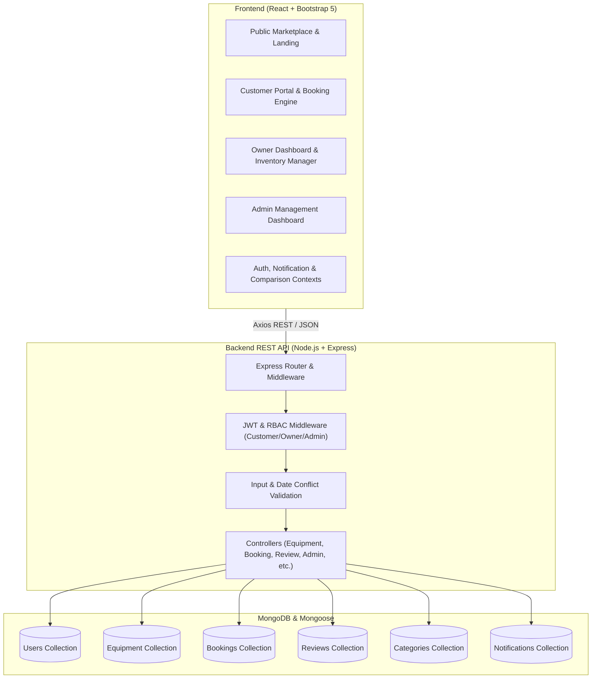
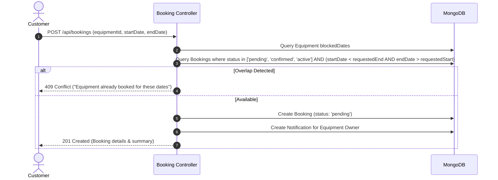

# RentalHub Architecture & Implementation Plan

RentalHub is a full-featured, production-style equipment rental marketplace platform built on the MERN stack (MongoDB, Express.js, React.js, Node.js, Bootstrap 5).

---

## 1. System Architecture

---

## 2. Core User Roles & Matrix

| Capability | Guest | Customer | Owner / Business | Administrator |
|---|:---:|:---:|:---:|:---:|
| Browse & Search Equipment | ✅ | ✅ | ✅ | ✅ |
| Compare Equipment Options | ✅ | ✅ | ✅ | ✅ |
| View Real-time Availability | ✅ | ✅ | ✅ | ✅ |
| Book Equipment with Conflict Prevention | ❌ | ✅ | ❌ | ❌ |
| Booking History & Return Tracking | ❌ | ✅ | ❌ | ❌ |
| Leave Equipment Reviews | ❌ | ✅ (Rented) | ❌ | ❌ |
| List & Manage Equipment Inventory | ❌ | ❌ | ✅ | ✅ (Supervise) |
| Manage Blocked Dates / Maintenance | ❌ | ❌ | ✅ | ✅ |
| Approve / Reject / Fulfill Bookings | ❌ | ❌ | ✅ | ✅ |
| Manage Categories | ❌ | ❌ | ❌ | ✅ |
| Manage Users & Moderation | ❌ | ❌ | ❌ | ✅ |
| Global Analytics & Oversight | ❌ | ❌ | ❌ | ✅ |

---

## 3. Database Schema & Relationships

### `Users`
- `_id`, `name`, `email` (unique), `password` (bcrypt hash), `role` (`'customer' | 'owner' | 'admin'`), `phone`, `address`, `companyName`, `avatar`, `isActive`, `createdAt`, `updatedAt`

### `Categories`
- `_id`, `name`, `slug` (unique), `description`, `icon`, `image`, `createdAt`

### `Equipment`
- `_id`, `owner` (Ref -> User), `title`, `slug`, `category` (Ref -> Category), `description`, `condition` (`'New' | 'Like New' | 'Good' | 'Fair'`), `dailyRate`, `weeklyRate`, `securityDeposit`, `specifications` (`[{ key, value }]`), `images` (`[String]`), `location` (`{ address, city, state, zip }`), `isAvailable`, `blockedDates` (`[{ startDate, endDate, reason }]`), `rating`, `numReviews`, `isFeatured`, `createdAt`

### `Bookings`
- `_id`, `equipment` (Ref -> Equipment), `customer` (Ref -> User), `owner` (Ref -> User), `startDate`, `endDate`, `totalDays`, `dailyRate`, `rentAmount`, `securityDeposit`, `totalAmount`, `status` (`'pending' | 'confirmed' | 'active' | 'returned' | 'cancelled' | 'rejected'`), `deliveryMethod` (`'pickup' | 'delivery'`), `deliveryAddress`, `notes`, `cancellationReason`, `createdAt`

### `Reviews`
- `_id`, `equipment` (Ref -> Equipment), `customer` (Ref -> User), `booking` (Ref -> Booking), `rating` (1-5), `comment`, `createdAt`

### `Notifications`
- `_id`, `recipient` (Ref -> User), `sender` (Ref -> User), `title`, `message`, `type` (`'booking' | 'status' | 'review' | 'system'`), `link`, `isRead`, `createdAt`

---

## 4. Key Workflows

### A. Double-Booking Prevention Algorithm

### B. Booking Lifecycle & Transitions
- `pending`: Created by customer, awaiting owner confirmation.
- `confirmed`: Accepted by owner. Equipment is reserved.
- `active`: Equipment picked up or delivered to customer.
- `returned`: Equipment returned by customer, inspected, security deposit released.
- `cancelled`: Cancelled by customer before start date.
- `rejected`: Declined by owner (e.g. equipment under unexpected repair).

---

## 5. Technology Stack & Directory Structure
- **Backend**: Node.js v24, Express 4.x, Mongoose 8.x, JSON Web Token (`jsonwebtoken`), `bcryptjs`, `cors`, `dotenv`.
- **Frontend**: React 18, React Router v6, Bootstrap 5.3, Bootstrap Icons, Axios.
- **Path**: `C:\Users\DELL USER\.gemini\antigravity\scratch\rentalhub`
